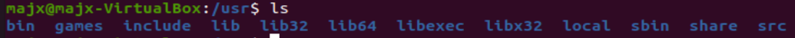

# rocksdb学习

## 更新软件

### 编辑源命令

注：此步操作实际上已在操作系统实验1实现。

```sh
majx@majx-VirtualBox:~/Rocksdb$ sudo gedit /etc/apt/sources.list
```

源命令如下：

```list
# 默认注释了源码镜像以提高 apt update 速度，如有需要可自行取消注释
deb https://mirrors.tuna.tsinghua.edu.cn/ubuntu/ focal main restricted universe multiverse
# deb-src https://mirrors.tuna.tsinghua.edu.cn/ubuntu/ focal main restricted universe multiverse
deb https://mirrors.tuna.tsinghua.edu.cn/ubuntu/ focal-updates main restricted universe multiverse
# deb-src https://mirrors.tuna.tsinghua.edu.cn/ubuntu/ focal-updates main restricted universe multiverse
deb https://mirrors.tuna.tsinghua.edu.cn/ubuntu/ focal-backports main restricted universe multiverse
# deb-src https://mirrors.tuna.tsinghua.edu.cn/ubuntu/ focal-backports main restricted universe multiverse
deb https://mirrors.tuna.tsinghua.edu.cn/ubuntu/ focal-security main restricted universe multiverse
# deb-src https://mirrors.tuna.tsinghua.edu.cn/ubuntu/ focal-security main restricted universe multiverse

# 预发布软件源，不建议启用
# deb https://mirrors.tuna.tsinghua.edu.cn/ubuntu/ focal-proposed main restricted universe multiverse
# deb-src https://mirrors.tuna.tsinghua.edu.cn/ubuntu/ focal-proposed main restricted universe multiverse
deb [arch=amd64] https://packages.microsoft.com/repos/vscode stable main
# deb-src [arch=amd64] https://packages.microsoft.com/repos/vscode stable main
```

### 读取软件列表

```sh
majx@majx-VirtualBox:~/Rocksdb$ sudo apt-get update
```

此命令会访问源列表里的每个网址，并读取软件列表，然后保存在本地电脑。

### 更新本地已安装的软件

```sh
majx@majx-VirtualBox:~/Rocksdb$ sudo apt-get upgrade
```

此命令会把本地已安装的软件，与刚才下载的软件列表里对应软件进行对比。如果发现已安装的软件版本太低，就会提示更新，如下：

```sh
下列软件包将被升级：
  alsa-ucm-conf apport apport-gtk bolt code gnome-control-center gnome-control-center-data gnome-control-center-faces grub-common grub-pc
  grub-pc-bin grub2-common gvfs gvfs-backends gvfs-bin gvfs-common gvfs-daemons gvfs-fuse gvfs-libs iio-sensor-proxy libc-bin libc-dev-bin
  libc6 libc6-dbg libc6-dev libc6-dev-i386 libc6-dev-x32 libc6-i386 libc6-x32 libfprint-2-2 libfprint-2-tod1 libnetplan0 libnss-systemd
  libpam-systemd librados2 librbd1 libsensors-config libsensors5 libsmbclient libsystemd0 libudev1 libwbclient0 linux-firmware locales
  microsoft-edge-dev netplan.io openssh-client python3-apport python3-distupgrade python3-problem-report samba-libs sbsigntool snapd
  systemd systemd-sysv systemd-timesyncd ubuntu-advantage-tools ubuntu-drivers-common ubuntu-release-upgrader-core
  ubuntu-release-upgrader-gtk udev
升级了 61 个软件包，新安装了 0 个软件包，要卸载 0 个软件包，有 0 个软件包未被升级。
```

#### 问题1

更新本地已安装的软件时，遇到以下问题：

```sh
majx@majx-VirtualBox:~/Rocksdb$ sudo apt-get upgrade
E: 无法获得锁 /var/lib/dpkg/lock-frontend。锁正由进程 22983（unattended-upgr）持有
N: 请注意，直接移除锁文件不一定是合适的解决方案，且可能损坏您的系统。
E: 无法获取 dpkg 前端锁 (/var/lib/dpkg/lock-frontend)，是否有其他进程正占用它？
```

解决方法：

尝试搜索是不是软件更新器在占用锁，如果是则杀掉该进程：

```sh
majx@majx-VirtualBox:~/Rocksdb$ ps -e|grep unattended-upgr
    724 ?        00:00:00 unattended-upgr
majx@majx-VirtualBox:~/Rocksdb$ sudo kill 724
```

其中，`ps -e`用于列出程序时，显示每个程序所使用的环境变量，724是进程`pid`。

## 安装依赖

参考[rocksdb/INSTALL.md at main · facebook/rocksdb (github.com)](https://github.com/facebook/rocksdb/blob/main/INSTALL.md)

- 更新 gcc 的版本到 4.8 或更高以获得 C++11 的特性:

  ```shell
  majx@majx-VirtualBox:~/Rocksdb$ gcc -v
  Using built-in specs.
  COLLECT_GCC=gcc
  COLLECT_LTO_WRAPPER=/usr/lib/gcc/x86_64-linux-gnu/9/lto-wrapper
  OFFLOAD_TARGET_NAMES=nvptx-none:hsa
  OFFLOAD_TARGET_DEFAULT=1
  Target: x86_64-linux-gnu
  Configured with: ../src/configure -v --with-pkgversion='Ubuntu 9.4.0-1ubuntu1~20.04.1' --with-bugurl=file:///usr/share/doc/gcc-9/README.Bugs --enable-languages=c,ada,c++,go,brig,d,fortran,objc,obj-c++,gm2 --prefix=/usr --with-gcc-major-version-only --program-suffix=-9 --program-prefix=x86_64-linux-gnu- --enable-shared --enable-linker-build-id --libexecdir=/usr/lib --without-included-gettext --enable-threads=posix --libdir=/usr/lib --enable-nls --enable-clocale=gnu --enable-libstdcxx-debug --enable-libstdcxx-time=yes --with-default-libstdcxx-abi=new --enable-gnu-unique-object --disable-vtable-verify --enable-plugin --enable-default-pie --with-system-zlib --with-target-system-zlib=auto --enable-objc-gc=auto --enable-multiarch --disable-werror --with-arch-32=i686 --with-abi=m64 --with-multilib-list=m32,m64,mx32 --enable-multilib --with-tune=generic --enable-offload-targets=nvptx-none=/build/gcc-9-Av3uEd/gcc-9-9.4.0/debian/tmp-nvptx/usr,hsa --without-cuda-driver --enable-checking=release --build=x86_64-linux-gnu --host=x86_64-linux-gnu --target=x86_64-linux-gnu
  Thread model: posix
  gcc version 9.4.0 (Ubuntu 9.4.0-1ubuntu1~20.04.1) 
  ```

- 安装 gflags:

  ```sh
  majx@majx-VirtualBox:~/Rocksdb$ sudo apt-get install libgflags-dev
  ```

- 安装 snappy:

  ```shell
  majx@majx-VirtualBox:~/Rocksdb$ sudo apt-get install libsnappy-dev
  ```

- 安装 zlib:

  ```sh
  majx@majx-VirtualBox:~/Rocksdb$ sudo apt-get install zlib1g-dev
  ```

- 安装 bzip2:

  ```sh
  majx@majx-VirtualBox:~/Rocksdb$ sudo apt-get install libbz2-dev
  ```

- 安装 lz4:

  ```sh
  majx@majx-VirtualBox:~/Rocksdb$ sudo apt-get install liblz4-dev
  ```

- 安装 zstandard:

  ```sh
  majx@majx-VirtualBox:~/Rocksdb$ sudo apt-get install libzstd-dev
  ```

## 下载并安装`Rocksdb`

### 下载

```sh
majx@majx-VirtualBox:~/Rocksdb$ wget -O rocksdb-7.2.0.tar.gz https://github.com/facebook/rocksdb/archive/v7.2.0.tar.gz
```

### 解压

```shell
majx@majx-VirtualBox:~/Rocksdb$ tar -xzvf rocksdb-7.2.0.tar.gz
```

#### 问题2

一开始参照网上给出的教程，下载的网址是：

```sh
wget https://github.com/facebook/rocksdb/archive/v6.6.4.zip #6.6.4 (2020-01-31)
```

但是后面发现解压`unzip`不成功，手动解压也不行。

通过上网搜寻，说有可能是如下原因：

> 发现unzip只能解压不超过2G的文件，如果超过2G的大小限制，只能用另外的方法来解压。

但是查看大小发现没有超过2G：


不管三七二十一，死马当活马医，先试试看再说。

于是下载了`fastjar`用来解压：

```sh
majx@majx-VirtualBox:~/Rocksdb$ sudo apt-get install fastjar
majx@majx-VirtualBox:~/Rocksdb$ jar xvf v6.6.4.zip
```

产生了如下输出，即依旧不能成功解压：


此外，通过浏览器搜索这个网址会报出如下错误：

```
the given path has multiple possibilities: #<Git::Ref:0x00007fa8683237d8>, #<Git::Ref:0x00007fa868340f90>
```

与`fastjar`解压没成功的报错一样，说：给定路径有多种可能性。

那就换个网址吧，通过查询[rocksdb/HISTORY.md at main · facebook/rocksdb (github.com)](https://github.com/facebook/rocksdb/blob/main/HISTORY.md)发现最新版本是7.2.0，再结合网上一些教程给出的下载网址的格式，我猜了7.2.0的下载地址：https://github.com/facebook/rocksdb/archive/v7.2.0.tar.gz，可能在官方文档的某处有些，但是没找到...

结果等了6次才成功，看报告情况正确地址应该是：https://codeload.github.com/facebook/rocksdb/tar.gz/refs/tags/v7.2.0


### 编译`examples`

参考[rocksdb/README.md at main · facebook/rocksdb (github.com)](https://github.com/facebook/rocksdb/blob/main/examples/README.md)

- 首先通过在父目录中执行 make static_lib 来编译 RocksDB:

  ```sh
  majx@majx-VirtualBox:~/Rocksdb/rocksdb-7.2.0$ make static_lib
  ```

  此命令将会编译出一个 RocksDB 的静态库 librocksdb.a。这个静态库是 release 模式的。

- 然后编译样例:

  ```sh
  majx@majx-VirtualBox:~/Rocksdb/rocksdb-7.2.0$ cd examples
  majx@majx-VirtualBox:~/Rocksdb/rocksdb-7.2.0/examples$ ls
  CMakeLists.txt                c_simple_example.c                 options_file_example.cc          transaction_example.cc
  column_families_example.cc    Makefile                           README.md
  compact_files_example.cc      multi_processes_example.cc         rocksdb_option_file_example.ini
  compaction_filter_example.cc  optimistic_transaction_example.cc  simple_example.cc
  majx@majx-VirtualBox:~/Rocksdb/rocksdb-7.2.0/examples$ make all
  cd .. && make static_lib
  make[1]: 进入目录“/home/majx/Rocksdb/rocksdb-7.2.0”
  $DEBUG_LEVEL is 0
  make[1]: 对“static_lib”无需做任何事。
  make[1]: 离开目录“/home/majx/Rocksdb/rocksdb-7.2.0”
  g++ -fno-rtti simple_example.cc -osimple_example ../librocksdb.a -I../include -O2 -std=c++17 -lpthread -lrt -ldl -lsnappy -lgflags -lz -lbz2 -llz4 -lzstd -std=c++17  -faligned-new -DHAVE_ALIGNED_NEW -DROCKSDB_PLATFORM_POSIX -DROCKSDB_LIB_IO_POSIX  -DOS_LINUX -fno-builtin-memcmp -DROCKSDB_FALLOCATE_PRESENT -DSNAPPY -DGFLAGS=1 -DZLIB -DBZIP2 -DLZ4 -DZSTD -DROCKSDB_MALLOC_USABLE_SIZE -DROCKSDB_PTHREAD_ADAPTIVE_MUTEX -DROCKSDB_BACKTRACE -DROCKSDB_RANGESYNC_PRESENT -DROCKSDB_SCHED_GETCPU_PRESENT -DROCKSDB_AUXV_GETAUXVAL_PRESENT -march=native   -DHAVE_SSE42  -DHAVE_PCLMUL  -DHAVE_AVX2  -DHAVE_LZCNT -DHAVE_UINT128_EXTENSION -DROCKSDB_SUPPORT_THREAD_LOCAL   -ldl -lpthread
  g++ -fno-rtti column_families_example.cc -ocolumn_families_example ../librocksdb.a -I../include -O2 -std=c++17 -lpthread -lrt -ldl -lsnappy -lgflags -lz -lbz2 -llz4 -lzstd -std=c++17  -faligned-new -DHAVE_ALIGNED_NEW -DROCKSDB_PLATFORM_POSIX -DROCKSDB_LIB_IO_POSIX  -DOS_LINUX -fno-builtin-memcmp -DROCKSDB_FALLOCATE_PRESENT -DSNAPPY -DGFLAGS=1 -DZLIB -DBZIP2 -DLZ4 -DZSTD -DROCKSDB_MALLOC_USABLE_SIZE -DROCKSDB_PTHREAD_ADAPTIVE_MUTEX -DROCKSDB_BACKTRACE -DROCKSDB_RANGESYNC_PRESENT -DROCKSDB_SCHED_GETCPU_PRESENT -DROCKSDB_AUXV_GETAUXVAL_PRESENT -march=native   -DHAVE_SSE42  -DHAVE_PCLMUL  -DHAVE_AVX2  -DHAVE_LZCNT -DHAVE_UINT128_EXTENSION -DROCKSDB_SUPPORT_THREAD_LOCAL   -ldl -lpthread
  g++ -fno-rtti compact_files_example.cc -ocompact_files_example ../librocksdb.a -I../include -O2 -std=c++17 -lpthread -lrt -ldl -lsnappy -lgflags -lz -lbz2 -llz4 -lzstd -std=c++17  -faligned-new -DHAVE_ALIGNED_NEW -DROCKSDB_PLATFORM_POSIX -DROCKSDB_LIB_IO_POSIX  -DOS_LINUX -fno-builtin-memcmp -DROCKSDB_FALLOCATE_PRESENT -DSNAPPY -DGFLAGS=1 -DZLIB -DBZIP2 -DLZ4 -DZSTD -DROCKSDB_MALLOC_USABLE_SIZE -DROCKSDB_PTHREAD_ADAPTIVE_MUTEX -DROCKSDB_BACKTRACE -DROCKSDB_RANGESYNC_PRESENT -DROCKSDB_SCHED_GETCPU_PRESENT -DROCKSDB_AUXV_GETAUXVAL_PRESENT -march=native   -DHAVE_SSE42  -DHAVE_PCLMUL  -DHAVE_AVX2  -DHAVE_LZCNT -DHAVE_UINT128_EXTENSION -DROCKSDB_SUPPORT_THREAD_LOCAL   -ldl -lpthread
  cc -Wstrict-prototypes -c c_simple_example.c -o c_simple_example.o -I../include
  g++ c_simple_example.o -oc_simple_example ../librocksdb.a -lpthread -lrt -ldl -lsnappy -lgflags -lz -lbz2 -llz4 -lzstd  -ldl -lpthread
  g++ -fno-rtti optimistic_transaction_example.cc -ooptimistic_transaction_example ../librocksdb.a -I../include -O2 -std=c++17 -lpthread -lrt -ldl -lsnappy -lgflags -lz -lbz2 -llz4 -lzstd -std=c++17  -faligned-new -DHAVE_ALIGNED_NEW -DROCKSDB_PLATFORM_POSIX -DROCKSDB_LIB_IO_POSIX  -DOS_LINUX -fno-builtin-memcmp -DROCKSDB_FALLOCATE_PRESENT -DSNAPPY -DGFLAGS=1 -DZLIB -DBZIP2 -DLZ4 -DZSTD -DROCKSDB_MALLOC_USABLE_SIZE -DROCKSDB_PTHREAD_ADAPTIVE_MUTEX -DROCKSDB_BACKTRACE -DROCKSDB_RANGESYNC_PRESENT -DROCKSDB_SCHED_GETCPU_PRESENT -DROCKSDB_AUXV_GETAUXVAL_PRESENT -march=native   -DHAVE_SSE42  -DHAVE_PCLMUL  -DHAVE_AVX2  -DHAVE_LZCNT -DHAVE_UINT128_EXTENSION -DROCKSDB_SUPPORT_THREAD_LOCAL   -ldl -lpthread
  g++ -fno-rtti transaction_example.cc -otransaction_example ../librocksdb.a -I../include -O2 -std=c++17 -lpthread -lrt -ldl -lsnappy -lgflags -lz -lbz2 -llz4 -lzstd -std=c++17  -faligned-new -DHAVE_ALIGNED_NEW -DROCKSDB_PLATFORM_POSIX -DROCKSDB_LIB_IO_POSIX  -DOS_LINUX -fno-builtin-memcmp -DROCKSDB_FALLOCATE_PRESENT -DSNAPPY -DGFLAGS=1 -DZLIB -DBZIP2 -DLZ4 -DZSTD -DROCKSDB_MALLOC_USABLE_SIZE -DROCKSDB_PTHREAD_ADAPTIVE_MUTEX -DROCKSDB_BACKTRACE -DROCKSDB_RANGESYNC_PRESENT -DROCKSDB_SCHED_GETCPU_PRESENT -DROCKSDB_AUXV_GETAUXVAL_PRESENT -march=native   -DHAVE_SSE42  -DHAVE_PCLMUL  -DHAVE_AVX2  -DHAVE_LZCNT -DHAVE_UINT128_EXTENSION -DROCKSDB_SUPPORT_THREAD_LOCAL   -ldl -lpthread
  g++ -fno-rtti compaction_filter_example.cc -ocompaction_filter_example ../librocksdb.a -I../include -O2 -std=c++17 -lpthread -lrt -ldl -lsnappy -lgflags -lz -lbz2 -llz4 -lzstd -std=c++17  -faligned-new -DHAVE_ALIGNED_NEW -DROCKSDB_PLATFORM_POSIX -DROCKSDB_LIB_IO_POSIX  -DOS_LINUX -fno-builtin-memcmp -DROCKSDB_FALLOCATE_PRESENT -DSNAPPY -DGFLAGS=1 -DZLIB -DBZIP2 -DLZ4 -DZSTD -DROCKSDB_MALLOC_USABLE_SIZE -DROCKSDB_PTHREAD_ADAPTIVE_MUTEX -DROCKSDB_BACKTRACE -DROCKSDB_RANGESYNC_PRESENT -DROCKSDB_SCHED_GETCPU_PRESENT -DROCKSDB_AUXV_GETAUXVAL_PRESENT -march=native   -DHAVE_SSE42  -DHAVE_PCLMUL  -DHAVE_AVX2  -DHAVE_LZCNT -DHAVE_UINT128_EXTENSION -DROCKSDB_SUPPORT_THREAD_LOCAL   -ldl -lpthread
  g++ -fno-rtti options_file_example.cc -ooptions_file_example ../librocksdb.a -I../include -O2 -std=c++17 -lpthread -lrt -ldl -lsnappy -lgflags -lz -lbz2 -llz4 -lzstd -std=c++17  -faligned-new -DHAVE_ALIGNED_NEW -DROCKSDB_PLATFORM_POSIX -DROCKSDB_LIB_IO_POSIX  -DOS_LINUX -fno-builtin-memcmp -DROCKSDB_FALLOCATE_PRESENT -DSNAPPY -DGFLAGS=1 -DZLIB -DBZIP2 -DLZ4 -DZSTD -DROCKSDB_MALLOC_USABLE_SIZE -DROCKSDB_PTHREAD_ADAPTIVE_MUTEX -DROCKSDB_BACKTRACE -DROCKSDB_RANGESYNC_PRESENT -DROCKSDB_SCHED_GETCPU_PRESENT -DROCKSDB_AUXV_GETAUXVAL_PRESENT -march=native   -DHAVE_SSE42  -DHAVE_PCLMUL  -DHAVE_AVX2  -DHAVE_LZCNT -DHAVE_UINT128_EXTENSION -DROCKSDB_SUPPORT_THREAD_LOCAL   -ldl -lpthread
  ```

### 安装

#### 编译静态库

```sh
majx@majx-VirtualBox:~/Rocksdb/rocksdb-7.2.0$ make static_lib
```

此命令将会编译出一个 RocksDB 的静态库 librocksdb.a。这个静态库是 release 模式的。

#### 编译动态库

```sh
majx@majx-VirtualBox:~/Rocksdb/rocksdb-7.2.0$ make shared_lib
```

此命令将会编译出一个 RocksDB 的动态库 librocksdb.so。这个动态库是 release 模式的。

##### 问题3

在编译动态库时，遇到以下问题：

```sh
majx@majx-VirtualBox:~/Rocksdb/rocksdb-7.2.0$ make shared_lib
$DEBUG_LEVEL is 0
  CCLD     librocksdb.so.7.2.0
/usr/bin/ld: ./memory/concurrent_arena.o: relocation R_X86_64_TPOFF32 against symbol `_ZN7rocksdb15ConcurrentArena9tls_cpuidE' can not be used when making a shared object; recompile with -fPIC
/usr/bin/ld: ./monitoring/iostats_context.o: relocation R_X86_64_TPOFF32 against symbol `_ZN7rocksdb15iostats_contextE' can not be used when making a shared object; recompile with -fPIC
/usr/bin/ld: ./monitoring/perf_context.o: relocation R_X86_64_TPOFF32 against `__tls_guard' can not be used when making a shared object; recompile with -fPIC
/usr/bin/ld: ./monitoring/perf_level.o: relocation R_X86_64_TPOFF32 against symbol `_ZN7rocksdb10perf_levelE' can not be used when making a shared object; recompile with -fPIC
/usr/bin/ld: ./monitoring/thread_status_updater.o: relocation R_X86_64_TPOFF32 against symbol `_ZN7rocksdb19ThreadStatusUpdater19thread_status_data_E' can not be used when making a shared object; recompile with -fPIC
/usr/bin/ld: ./monitoring/thread_status_util.o: relocation R_X86_64_TPOFF32 against symbol `_ZN7rocksdb16ThreadStatusUtil27thread_updater_initialized_E' can not be used when making a shared object; recompile with -fPIC
/usr/bin/ld: ./util/random.o: relocation R_X86_64_TPOFF32 against `_ZZN7rocksdb6Random14GetTLSInstanceEvE12tls_instance' can not be used when making a shared object; recompile with -fPIC
/usr/bin/ld: ./util/thread_local.o: relocation R_X86_64_TPOFF32 against symbol `_ZN7rocksdb14ThreadLocalPtr10StaticMeta4tls_E' can not be used when making a shared object; recompile with -fPIC
/usr/bin/ld: ./utilities/agg_merge/agg_merge.o: relocation R_X86_64_TPOFF32 against `_ZGVZN7rocksdb16AggMergeOperator17GetTLSAccumulatorEvE7tls_acc' can not be used when making a shared object; recompile with -fPIC
/usr/bin/ld: ./cache/cache.o: relocation R_X86_64_PC32 against symbol `_ZN7rocksdb23kDefaultToAdaptiveMutexE' can not be used when making a shared object; recompile with -fPIC
/usr/bin/ld: 最后的链结失败: bad value
collect2: error: ld returned 1 exit status
make: *** [Makefile:796：librocksdb.so.7.2.0] 错误 1
```

解决方法：

```sh
majx@majx-VirtualBox:~/Rocksdb/rocksdb-7.2.0$ make clean
```

然后再编译动态库，具体原因还没搞明白...

#### 安装

```sh
majx@majx-VirtualBox:~/Rocksdb/rocksdb-7.2.0$ sudo make install-static
majx@majx-VirtualBox:~/Rocksdb/rocksdb-7.2.0$ sudo make install-shared
```

查看`Makefile`的相关制作目标：

```makefile
#-------------------------------------------------
# make install related stuff
PREFIX ?= /usr/local
LIBDIR ?= $(PREFIX)/lib
INSTALL_LIBDIR = $(DESTDIR)$(LIBDIR)

uninstall:
	rm -rf $(DESTDIR)$(PREFIX)/include/rocksdb \
	  $(INSTALL_LIBDIR)/$(LIBRARY) \
	  $(INSTALL_LIBDIR)/$(SHARED4) \
	  $(INSTALL_LIBDIR)/$(SHARED3) \
	  $(INSTALL_LIBDIR)/$(SHARED2) \
	  $(INSTALL_LIBDIR)/$(SHARED1) \
	  $(INSTALL_LIBDIR)/pkgconfig/rocksdb.pc

install-headers: gen-pc
	install -d $(INSTALL_LIBDIR)
	install -d $(INSTALL_LIBDIR)/pkgconfig
	for header_dir in `$(FIND) "include/rocksdb" -type d`; do \
		install -d $(DESTDIR)/$(PREFIX)/$$header_dir; \
	done
	for header in `$(FIND) "include/rocksdb" -type f -name *.h`; do \
		install -C -m 644 $$header $(DESTDIR)/$(PREFIX)/$$header; \
	done
	for header in $(ROCKSDB_PLUGIN_HEADERS); do \
		install -d $(DESTDIR)/$(PREFIX)/include/rocksdb/`dirname $$header`; \
		install -C -m 644 $$header $(DESTDIR)/$(PREFIX)/include/rocksdb/$$header; \
	done
	install -C -m 644 rocksdb.pc $(INSTALL_LIBDIR)/pkgconfig/rocksdb.pc

install-static: install-headers $(LIBRARY)
	install -d $(INSTALL_LIBDIR)
	install -C -m 755 $(LIBRARY) $(INSTALL_LIBDIR)

install-shared: install-headers $(SHARED4)
	install -d $(INSTALL_LIBDIR)
	install -C -m 755 $(SHARED4) $(INSTALL_LIBDIR)
	ln -fs $(SHARED4) $(INSTALL_LIBDIR)/$(SHARED3)
	ln -fs $(SHARED4) $(INSTALL_LIBDIR)/$(SHARED2)
	ln -fs $(SHARED4) $(INSTALL_LIBDIR)/$(SHARED1)

# install static by default + install shared if it exists
install: install-static
	[ -e $(SHARED4) ] && $(MAKE) install-shared || :

# Generate the pkg-config file
gen-pc:
	-echo 'prefix=$(PREFIX)' > rocksdb.pc
	-echo 'exec_prefix=$${prefix}' >> rocksdb.pc
	-echo 'includedir=$${prefix}/include' >> rocksdb.pc
	-echo 'libdir=$(LIBDIR)' >> rocksdb.pc
	-echo '' >> rocksdb.pc
	-echo 'Name: rocksdb' >> rocksdb.pc
	-echo 'Description: An embeddable persistent key-value store for fast storage' >> rocksdb.pc
	-echo Version: $(shell ./build_tools/version.sh full) >> rocksdb.pc
	-echo 'Libs: -L$${libdir} $(EXEC_LDFLAGS) -lrocksdb' >> rocksdb.pc
	-echo 'Libs.private: $(PLATFORM_LDFLAGS)' >> rocksdb.pc
	-echo 'Cflags: -I$${includedir} $(PLATFORM_CXXFLAGS)' >> rocksdb.pc
	-echo 'Requires: $(subst ",,$(ROCKSDB_PLUGIN_PKGCONFIG_REQUIRES))' >> rocksdb.pc

#-------------------------------------------------
```

以上命令将程序安装至系统中，路径是`/usr/local/lib`。

查看`/usr/local/lib`，已安装成功：


#### 设置环境变量

- 刷新动态库

  参考：https://blog.csdn.net/winycg/article/details/80572735

  ```sh
  majx@majx-VirtualBox:~/Rocksdb/rocksdb-7.2.0$ sudo ldconfig -v
  ```

  其中，`ldconfig`：默认搜寻目录`/lib`和`/usr/lib`以及动态库配置文件`/etc/ld.so.conf`内所列的目录下，搜索出可共享的动态链接库（格式如`lib*.so*`）,进而创建出动态装入程序(`ld.so`)所需的连接和缓存文件，缓存文件默认为`/etc/ld.so.cache`，此文件保存已排好序的动态链接库名字列表。

  `linux`下的共享库机制采用了类似高速缓存机制，将库信息保存在`/etc/ld.so.cache`，程序连接的时候首先从这个文件里查找，然后再到`ld.so.conf`的路径中查找。为了让动态链接库为系统所共享，需运行动态链接库的管理命令`ldconfig`，此执行程序存放在`/sbin`目录下。

  其中，`-v`参数会显示正在扫描的目录及搜索到的动态链接库,还有它所创建的连接的名字。

- 指定`shared_lib`的安装路径

  ```sh
  majx@majx-VirtualBox:~/Rocksdb/rocksdb-7.2.0$ INSTALL_PATH=/usr
  ```

- 安装`shared_lib`

  ```sh
  majx@majx-VirtualBox:~/Rocksdb/rocksdb-7.2.0$ make shared_lib && sudo make install-shared
  ```

- 刷新动态库

  ```sh
  majx@majx-VirtualBox:~/Rocksdb/rocksdb-7.2.0$ sudo ldconfig -v
  ```

##### 问题4

在刷新动态库动态库时，`-v`参数会显示正在扫描的目录，结果显示没有`/usr/local/lib/x86_64-linux-gnu `，但似乎没有影响...

```sh
majx@majx-VirtualBox:~/Rocksdb/rocksdb-7.2.0$ sudo ldconfig -v
/sbin/ldconfig.real: 无法对 /usr/local/lib/x86_64-linux-gnu 进行 stat 操作: 没有那个文件或目录
/sbin/ldconfig.real: 多次给出路径“/usr/lib/x86_64-linux-gnu”
/sbin/ldconfig.real: 多次给出路径“/usr/lib32”
/sbin/ldconfig.real: 多次给出路径“/usr/libx32”
/sbin/ldconfig.real: 多次给出路径“/lib/x86_64-linux-gnu”
/sbin/ldconfig.real: 多次给出路径“/usr/lib/x86_64-linux-gnu”
/sbin/ldconfig.real: 多次给出路径“/usr/lib”
···
```

此外为什么要在设置环境再安装一次`shared_lib`？在上一步已经安装了，并且为什么设置安装路径是`INSTALL_PATH=/usr`，也没发现`/usr`有相关文件：



#### 测试

##### `test.cpp`

来源于：[Ubuntu安装Rocksdb并调试 - 鉴尘人 - 博客园 (cnblogs.com)](https://www.cnblogs.com/renjc/p/rocksdb-install.html)（还没看懂代码的逻辑...

```cpp
#include <cstdio>
#include <string>
#include "rocksdb/db.h"
#include "rocksdb/slice.h"
#include "rocksdb/options.h"

using namespace std;
using namespace rocksdb;

const std::string PATH = "/tmp/rocksdb_tmp"; // 

int main(){
    DB* db;
    Options options;
    options.create_if_missing = true;
    Status status = DB::Open(options, PATH, &db);
    assert(status.ok());
    Slice key("foo");
    Slice value("bar");
    std::string get_value;
    status = db->Put(WriteOptions(), key, value);
    if(status.ok()){
        status = db->Get(ReadOptions(), key, &get_value);
        if(status.ok()){
            printf("get %s success!!\n", get_value.c_str());
        }
        else{
            printf("get failed\n");
        }
    }
    else{
        printf("put failed\n");
    }
    delete db;
    return 0;
}
```

##### 编译运行

###### 动态编译

```sh
majx@majx-VirtualBox:~/Rocksdb/rocksdb-7.2.0$ g++ -std=c++17 -o rocksdbtest test.cpp -lrocksdb  -lpthread -ldl
majx@majx-VirtualBox:~/Rocksdb/rocksdb-7.2.0$ ./rocksdbtest
get bar success!!
```

- 参数说明：
  - `-std=c++17 `：使用C++17标准
  - `-lrocksdb `：引用`rocksdb`动态库
  - `-lpthread`：引用`pthread`动态库，用于多线程编程。
  - `-ldl`：表示生成的对象模块需要使用共享库

- 结果：显示`get bar success!!`，说明运行成功。

###### 问题5

- 动态编译错误：

  

​		看报错，应该将`-std=c++11`修改为`-std=c++17`。

- 为什么需要引用`pthread`动态库呢？

  尝试去掉编译参数`-lpthread`，程序也能正常运行。

- 为什么需要引用`-ldl`呢？

  因为之前做实验也有使用过动态编译的方式，没出现过不加`-ldl`会出现错误的问题。

  在尝试去掉编译参数`-lpthread`、`-ldl`，程序也能正常运行。

  只去掉`-ldl`程序也能正常运行。

  

###### 静态编译

```sh
majx@majx-VirtualBox:~/Rocksdb/rocksdb-7.2.0$ g++ -std=c++17 -o rocksdbtest test.cpp ./librocksdb.a -lpthread -lsnappy  -lz -lbz2 -lzstd /usr/lib/x86_64-linux-gnu/liblz4.a -ldl
```

- 参数说明：

  - `-l*`：引用相关的动态库。

    - `snappy`：引用`snappy`， 一个用于数据快速压缩的库。

    - `z`：引用`zlib`，一个用于数据压缩的库。

    - `bz2`：引用`bzip2`，一个用于数据压缩的库。

    - `zstd`：引用`zstandard`， 快速实时压缩算法。

  - `./librocksdb.a`：直接指明`rocksdb.a`的路径，`./`是在当前目录下，所以是使用静态库。

  - `/usr/lib/x86_64-linux-gnu/liblz4.a`：直接指明`lz4`（一个用于数据极速压缩的库）的路径，也可以直接用`-llz4`。

###### 问题6

静态编译错误：

```sh
/lib/x86_64-linux-gnu/liblz4.a
/usr/bin/ld: ./librocksdb.a(env_posix.o): in function `rocksdb::(anonymous namespace)::PosixDynamicLibrary::~PosixDynamicLibrary()':
/home/majx/Rocksdb/rocksdb-7.2.0/env/env_posix.cc:108: undefined reference to `dlclose'
/usr/bin/ld: ./librocksdb.a(env_posix.o): in function `rocksdb::(anonymous namespace)::PosixDynamicLibrary::~PosixDynamicLibrary()':
/home/majx/Rocksdb/rocksdb-7.2.0/env/env_posix.cc:108: undefined reference to `dlclose'
/usr/bin/ld: ./librocksdb.a(env_posix.o): in function `std::_Sp_counted_ptr<rocksdb::(anonymous namespace)::PosixDynamicLibrary*, (__gnu_cxx::_Lock_policy)2>::_M_dispose()':
/home/majx/Rocksdb/rocksdb-7.2.0/env/env_posix.cc:108: undefined reference to `dlclose'
/usr/bin/ld: ./librocksdb.a(env_posix.o): in function `rocksdb::(anonymous namespace)::PosixDynamicLibrary::LoadSymbol(std::__cxx11::basic_string<char, std::char_traits<char>, std::allocator<char> > const&, void**)':
/home/majx/Rocksdb/rocksdb-7.2.0/env/env_posix.cc:112: undefined reference to `dlerror'
/usr/bin/ld: /home/majx/Rocksdb/rocksdb-7.2.0/env/env_posix.cc:113: undefined reference to `dlsym'
/usr/bin/ld: /home/majx/Rocksdb/rocksdb-7.2.0/env/env_posix.cc:117: undefined reference to `dlerror'
/usr/bin/ld: ./librocksdb.a(env_posix.o): in function `rocksdb::(anonymous namespace)::PosixEnv::LoadLibrary(std::__cxx11::basic_string<char, std::char_traits<char>, std::allocator<char> > const&, std::__cxx11::basic_string<char, std::char_traits<char>, std::allocator<char> > const&, std::shared_ptr<rocksdb::DynamicLibrary>*)':
/home/majx/Rocksdb/rocksdb-7.2.0/env/env_posix.cc:251: undefined reference to `dlopen'
/usr/bin/ld: /home/majx/Rocksdb/rocksdb-7.2.0/env/env_posix.cc:289: undefined reference to `dlerror'
/usr/bin/ld: /home/majx/Rocksdb/rocksdb-7.2.0/env/env_posix.cc:268: undefined reference to `dlopen'
/usr/bin/ld: /home/majx/Rocksdb/rocksdb-7.2.0/env/env_posix.cc:279: undefined reference to `dlopen'
collect2: error: ld returned 1 exit status
```

看起来都是对`dl*`函数未定义，而这些函数是实现在`dl`动态库中的，那么解决方法就是添加`-ldl`编译参数：

